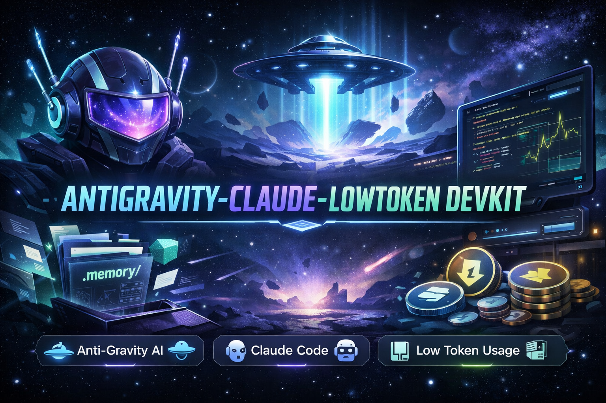

<p align="center">
  
</p>

<h1 align="center">🚀 Antigravity Claude LowToken Devkit</h1>

<p align="center">
  Memory-Driven AI Development System using <b>Claude Code + Antigravity</b> with <b>Ultra-Low Token Usage</b>
</p>

<p align="center">
  
  
  
  
</p>

---

## ✨ What is this?

This is a **production-grade AI development system** that turns stateless AI into a **persistent, context-aware engineering partner**.

Instead of re-explaining your project every time, you build a structured:

```
.memory/
```

👉 which acts as the **AI’s brain**

---

## 🔥 Core Benefits

- ⚡ Low Token Usage (only load required context)
- 🧠 Persistent Memory across sessions
- 🚫 No hallucination drift
- ⚙️ Works with Claude + Antigravity (Gemini)
- 🎯 Senior-level architecture & structure

---

## 🧠 Memory System

```
.memory/
├── architecture.md
├── ui-design.md
├── patterns.md
├── logic.md
├── assets.md
├── context.md
├── decisions.md
├── errors.md
├── env.md
└── todo.md
```

### File Responsibilities

- **architecture.md** → System design + rules
- **ui-design.md** → Design tokens (colors, spacing, typography)
- **patterns.md** → Coding standards & naming
- **logic.md** → Business logic
- **assets.md** → Images, icons, fonts
- **context.md** → Product purpose & goals
- **decisions.md** → Decisions + rejected approaches
- **errors.md** → Bugs + fixes
- **env.md** → Environment configs
- **todo.md** → Task tracking (AI re-entry point)

---

## ⚙️ Root Setup

```
CLAUDE.md   → Claude Code entry
GEMINI.md   → Antigravity entry
.gitattributes → Exclude memory from diffs
```

👉 Both point to the same `.memory/` → single source of truth

---

## ⚡ Token Optimization Rules

- Never load full codebase
- Only read required `.memory` files
- Add `.memory/` to `.gitattributes`
- Ignore `node_modules`

👉 Result: **massive token savings + faster AI**

---

## 🚀 Bootstrapping

### Option 1 — Autonomous

```txt
I am initiating a new project: [Project Name]

Goal: [Goal]
Tech Stack: [Stack]

Task:
1. Create .memory/
2. Setup architecture
3. Build UI system
```

---

### Option 2 — Plan First (Recommended)

#### Step 1 — Planning

```txt
Act as Senior Product Manager + Architect

Provide:
- Feature roadmap
- Tech stack
- Folder structure
- UI/UX philosophy
```

#### Step 2 — Build

```txt
Initialize project with:

- .memory/ system
- CLAUDE.md + GEMINI.md routing
- Architecture setup
- Design system
- Rules enforcement
```

---

## 📌 Memory Rules

- Update **architecture.md** for major decisions
- Store patterns in **patterns.md**
- Never use inline styles
- Log bugs in **errors.md**
- Log decisions in **decisions.md**
- Maintain **todo.md (1 active task only)**

---

## 🔄 Resume Workflow

When returning:

```txt
Read CLAUDE.md and .memory/
Summarize project and suggest next step
```

### Why it works

- 🚫 No hallucination
- ⚡ Instant context
- ✅ Perfect continuity

---

## ➕ Adding Features

Simple:

```txt
Add a new FD Calculator
```

Safe:

```txt
Check .memory/ and add FD Calculator
```

---

## ⚡ Works Best With Flash Models

Because context is:

- Small
- Structured
- Pre-digested

👉 Even lightweight models perform like advanced ones

---

## 🧾 Closing Ritual (CRITICAL)

Before ending session:

```txt
1. Update todo.md (exact progress)
2. Log decisions.md
3. Log errors.md
4. Update memory files

Respond: "Memory updated. Ready to resume."
```

---

## 🎯 Key Insight

> `.memory/` = AI Brain

- Persistent
- Structured
- Token-efficient

---

## 🧠 Final Outcome

You are no longer using AI as a tool.

You now have:

> **A permanent AI developer embedded in your codebase**

---

## 📌 Keywords

Antigravity • Claude Code • Low Token AI • Memory Driven Development • AI Dev Workflow • Efficient AI System
